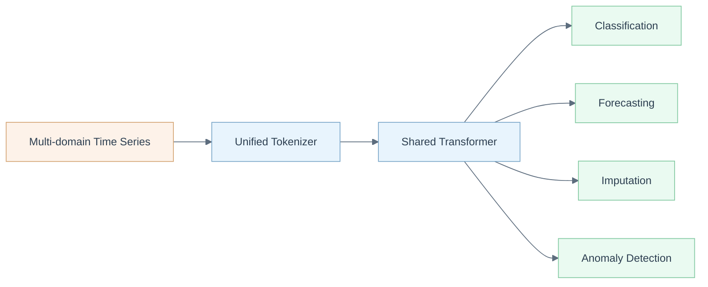

# UniTS (PLR Evaluation Fork)

Fork of [mims-harvard/UniTS](https://github.com/mims-harvard/UniTS) adapted for pupillary light reflex (PLR) biosignal evaluation under the [foundation_PLR](https://github.com/petteriTeikari/foundation_PLR) project.



## Why This Fork Exists

This fork was created because integrating UniTS as a submodule or dependency within [petteriTeikari/foundation_PLR](https://github.com/petteriTeikari/foundation_PLR) proved difficult due to UniTS's directory structure and script assumptions. Maintaining a separate fork with PLR-specific argument configs (`anomaly_PLR_args`, `anomaly_PLR_args_zeroshot`) allows clean experiment reproduction without modifying the upstream codebase.

**Parent project**: [petteriTeikari/foundation_PLR](https://github.com/petteriTeikari/foundation_PLR) -- Foundation models for pupillary light reflex biosignal analysis.

**Upstream**: [mims-harvard/UniTS](https://github.com/mims-harvard/UniTS) -- The original UniTS implementation by Harvard MIMS Lab.

## Overview

UniTS is a unified time series model that handles classification, forecasting, imputation, and anomaly detection with shared parameters and no task-specific modules. It uses a novel backbone combining sequence and variable attention with a dynamic linear operator, trained jointly across 38 multi-domain datasets.

This fork adds PLR-specific anomaly detection configurations for evaluating UniTS on pupillometric time series data.

## Key Features

- **Unified architecture** -- Single model for classification, forecasting, imputation, and anomaly detection
- **Multi-domain training** -- Joint training across diverse time series domains
- **Zero-shot and few-shot transfer** -- Generalizes to unseen datasets and task configurations
- **PLR configs** -- Pre-configured argument files for PLR biosignal anomaly detection

## Quick Start

```bash
pip install -r requirements.txt
bash download_data_all.sh

# PLR anomaly detection (few-shot)
bash ./scripts/few_shot_anomaly_detection/UniTS_finetune_few_shot_anomaly_detection.sh

# Standard multi-task training
bash ./scripts/pretrain_prompt_learning/UniTS_pretrain_x128.sh
```

See the upstream [Tutorial](Tutorial.md) for using UniTS on custom datasets.

## Citation

```bibtex
@inproceedings{gao2024units,
  title={UniTS: Building a Unified Time Series Model},
  author={Gao, Shanghua and Koker, Teddy and Queen, Owen and Hartvigsen, Thomas and Tsiligkaridis, Theodoros and Zitnik, Marinka},
  booktitle={NeurIPS},
  year={2024}
}
```

## License

MIT License (from upstream). See [LICENSE](LICENSE) for details.
